<div align="center">


<br/>

[](https://www.linkedin.com/in/harish-kumaravel)
[](https://harish-kumaravel.netlify.app/)

</div>

---

## 👨‍💻 `whoami`

```text
$ whoami
harish-kumaravel

$ cat about.txt
role      : Systems Developer @ MPAC
focus     : scalable data systems · event-driven architecture · agentic AI
stack     : Java · Quarkus · TypeScript · Next.js · PostgreSQL · AWS · Kubernetes
location  : Toronto area, Ontario, Canada
learning  : LLM tool calling · agent workflows · evals
```

I build backend and full-stack systems that move and manage large amounts of data. I also use Claude Code daily for code review and to automate repetitive engineering tasks.

---

## 📈 Work in numbers

<div align="center">



<sub>Click a card below to see what's behind the number.</sub>

</div>

<details>
<summary><b>📦 &nbsp;6M+ records and 4 source systems: what the migration involved</b></summary>

<br/>

I contributed to migrating 6M+ property records from four source systems (two PostgreSQL databases, Oracle and Redshift) into one PostgreSQL database. My part included writing the migration and validation SQL. Redshift served as a faster extraction source for fields that were stored as JSON in the operational databases.

</details>

<details>
<summary><b>🐳 &nbsp;50%: how the Docker images got smaller</b></summary>

<br/>

Multi-stage builds and hardened image security, run through GitLab CI/CD pipelines that deploy to Rancher/EKS. Quarkus also keeps application startup times low.

</details>

<details>
<summary><b>⏱️ &nbsp;2.5 years: where the time went</b></summary>

<br/>

I joined MPAC in May 2024 as a Junior Systems Developer and moved up to Systems Developer in December 2025. The work spans Java (Quarkus) APIs on PostgreSQL, event publishing through AWS SQS, the data-access layer for a property-owner portal, and support for legacy services.

</details>

---

## 🧰 Toolbox

<div align="center">


</div>

<details>
<summary><b>See the full stack</b></summary>

<br/>

| Area | Tools |
|---|---|
| **Languages** | Java, TypeScript/JavaScript, Python, SQL |
| **Backend** | Quarkus, Spring Boot, Node.js/NestJS, Flask/FastAPI |
| **Frontend** | React, Next.js, Angular, Tailwind CSS, React Native |
| **Data and messaging** | PostgreSQL, Oracle, Redshift, MongoDB, DynamoDB, Elasticsearch, AWS SQS, RabbitMQ |
| **Cloud and DevOps** | AWS, Docker, Kubernetes/Rancher, GitLab CI/CD, GitHub Actions, Jenkins |
| **Exploring now** | LLM tool calling, agent workflows, evals |

</details>

---

## 🚀 Selected projects

<div align="center">

<sub>Click a card to open the repository.</sub>

</div>

<table>
<tr>
<td width="50%"><a href="https://github.com/Harishcruise/e-psych"></a></td>
<td width="50%"><a href="https://github.com/Harishcruise/face_recognition"></a></td>
</tr>
<tr>
<td width="50%"><a href="https://github.com/Harishcruise/receipe-app"></a></td>
<td width="50%"><a href="https://github.com/Harishcruise/time-prediction-for-food-delivery"></a></td>
</tr>
</table>

<div align="center">

[Browse all repositories →](https://github.com/Harishcruise?tab=repositories)

</div>

---

## 🌱 Currently

- 🔭 Building toward **agentic AI workflows**: tool calling, multi-step agents and evaluation
- 🧱 Deepening **system design** for distributed, event-driven systems
- 💬 Happy to talk about data-heavy systems, platform engineering or applied AI

<div align="center">

<sub>Thanks for stopping by.</sub>

</div>
